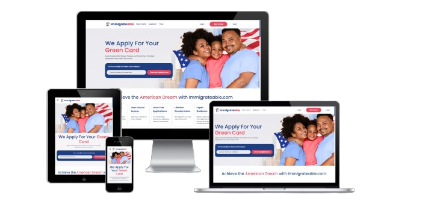

# React Vite Project

## Project Description
This project is a web application designed to help users apply for a Green Card. 🌍🌿🚀 The platform provides an intuitive user experience for visitors to:

- Check eligibility for a Green Card.
- Learn about the benefits of winning a Green Card.
- Explore economic incentives for different job categories.
- Complete the application process with expert guidance.

The application also offers subscription-based plans to assist users at different levels of support, including Pro, Elite, and VIP packages. 🌟🛠️🌊

---

## Technologies Used

The project leverages the following technologies: 🔧🌐🌄

- **React**: For building the user interface.
- **Vite**: For fast development and build processes.
- **Redux**: For state management across the application.
- **SASS**: For styling with flexibility and modularity.
- **MUI (Material-UI)**: For reusable UI components.

---


---

## 📷 Screenshots





---

## Links

- **Live Site**: [Start Your Green Card](https://startyourgreencard.com/)


## How to Run the Project

To set up and run the project locally, follow these steps: ⚙️🔪🌐

1. Clone the repository:
   ```bash
   git clone <repository-link>
   ```

2. Navigate to the project directory:
   ```bash
   cd project-directory
   ```

3. Install dependencies:
   ```bash
   npm install
   ```

4. Start the development server:
   ```bash
   npm run dev
   ```

5. Open your browser and navigate to:
   ```
   http://localhost:5173
   ```

---

## Features

- **User Authentication**:
  - Login and registration forms.
- **Eligibility Check**:
  - Simple form to check if a user qualifies for a Green Card.
- **Subscription Plans**:
  - Options for Pro, Elite, and VIP services.
- **Dynamic Sections**:
  - Testimonials, FAQs, and service benefits.
- **Responsive Design**:
  - Optimized for mobile, tablet, and desktop. 🌐🔒🏋️


